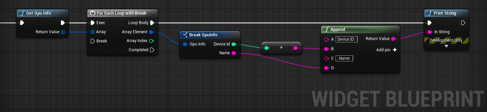

# How to use DirectXUtility module

Works on Windows only.  
An example can be found in "Content\NNEngineDemo\Common\WidgetToChangeCpuGpu.uasset" of the demo project.  

1. Call the "Get Gpu Info" node to get an array of Gpu Info structures, which is a list of GPUs available on your PC.
2. You can get the device ID and name from the Gpu Info structure.
3. You can specify which GPU to use by specifying this device ID when initializing the UOnnxModelWrapper or OnnxModel.

