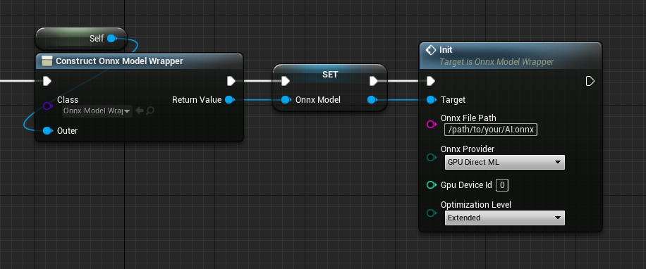

# How to use OnnxRuntime module

This module wraps the ONNX Runtime's C++ API and makes it easy to call from Unreal Engine's Blueprints and C++.  
An example of use from BP can be found in `Plugins\NNEngine\Content\MinimalExample\MinimalExampleOfOnnxModelWrapper.uasset`.  

??? Question "ONNX?"
    See [Overview of ONNX](../onnx-introduction) for more information on what ONNX is.

??? Question "ONNX Runtime?"
    See [the official documentation](https://onnxruntime.ai/docs/) for how to use ONNX Runtime itself.

## Load ONNX model

Load the AI ​​model saved in ONNX format.  
NNEngine reads the .onnx file by specifying the path at runtime.  

=== "BP"
	1. Create a Blueprint class and add a variable of UOnnxModelWrapper.
	2. Construct UOnnxModelWrapper and call "Init".
	- Specify the path to the ONNX model
	- Specify whether to use CPU or GPU, and which GPU to use.
		- To get available GPUs on the system, [call "Get Gpu Info".](../how-to-use-directx-utility-module)
		
	{ loading=lazy }

=== "C++"
	1. Create a C++ class and add a variable of OnnxModel.
	2. Call the constructor of OnnxModel.
	- Specify the path to the ONNX model
	- Specify whether to use CPU or GPU, and which GPU to use.
		- To get available GPUs on the system, call `UDirectXUtilityLibrary::GetGpuInfo()`.

	```
	#pragma once
	#include "OnnxModel.h"
	#include "OnnxModelMinimumExample.generated.h"

	UCLASS(Blueprintable, Category = "ONNX Runtime")
	class ONNXRUNTIME_API UOnnxModelMinimumExample : public UObject
	{
		GENERATED_BODY()

	protected:
		OnnxModel* onnxModel;

	public:
		UOnnxModelMinimumExample()
		{
			onnxModel = new OnnxModel("Full-path-to-your-AI.onnx", EOnnxProvider::GPU_DirectML, 0);
		}
	};
	```

## Specify input source

=== "BP"

	1. Call "Get Input Tensor Info" to confirm the order of the input tensors as well as their types and sizes.
	2. Add variables of byte, integer, integer64, or float arrays whose types and sizes match the previous results.  
		If you are using UE5 and float arrays for input. You need to create *single-precision* float arrays. See [this page](../ue5-float-bp).
	3. Call "Bind Input xxx Array" for each input tensor and specify the created array as the data input sources to the ONNX model.

	{ loading=lazy }

=== "C++"

	1. Get "inputTensorsInfo" member to confirm the order of the input tensors as well as their types and sizes.
	2. Add variables of arrays whose size in bytes match the previous results.
	3. Call "bindInput" as many as the number of input tensors and specify the created arrays as the data input sources to the ONNX model.

	```
		TArray<uint8> inputDataBuffer0;
		TArray<uint8> inputDataBuffer1;
		void setupInputs()
		{
			inputDataBuffer0.Init(0, 1 * 256 * 256 * 3);
			inputDataBuffer1.Init(0, 1);
			onnxModel->bindInput(onnxModel->inputTensorsInfo[0], inputDataBuffer0.GetData());
			onnxModel->bindInput(onnxModel->inputTensorsInfo[1], inputDataBuffer1.GetData());
		}
	```

## Specify output destination

=== "BP"

	1. Call "Get Output Tensor Info" to confirm the order of the output tensors as well as their types and sizes.
	2. Add variables of byte, integer, integer64, or float arrays whose types and sizes match the previous results.  
		If you are using UE5 and float arrays for output. You need to create *single-precision* float arrays. See [this page](../ue5-float-bp).
	3. Call "Bind Output xxx Array" for each output tensor and specify the created array as the data output destination from the ONNX model.

	{ loading=lazy }

=== "C++"

	1. Get "outputTensorsInfo" member to confirm the order of the output tensors as well as their types and sizes.
	2. Add variables of array whose size in bytes match the previous result.
	3. Call "bindOutput" for each output tensor and specify the created array as the data output destination from the ONNX model.

	```
		TArray<uint8> outputDataBuffer0;
		TArray<uint8> outputDataBuffer1;
		void setupOutputs()
		{
			outputDataBuffer0.Init(0, 17 * 3);
			outputDataBuffer1.Init(0, 4 * 4);
			onnxModel->bindOutput(onnxModel->outputTensorsInfo[0], outputDataBuffer0.GetData());
			onnxModel->bindOutput(onnxModel->outputTensorsInfo[1], outputDataBuffer1.GetData());
		}
	```

## Run

1. Set data to the array specified as the data input source for the ONNX model.
2. Call "Run".
3. Get data from the array specified as the data output destination for the ONNX model.

=== "BP"

	{ loading=lazy }

=== "C++"
	`onnxModel->run();`