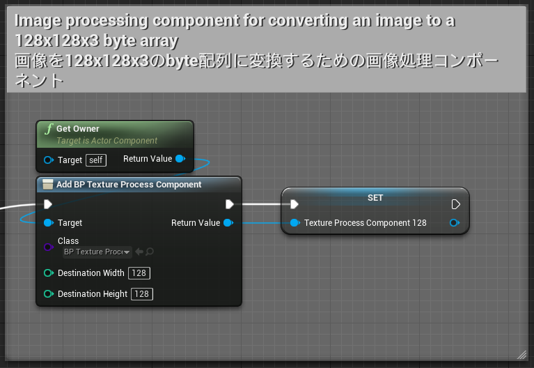
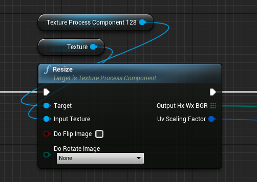
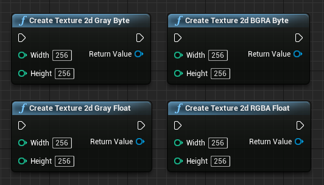
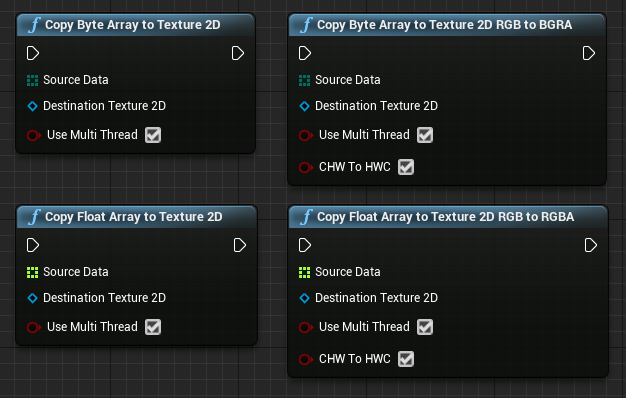

# How to use TextureProcessing module

Use `TextureProcessComponent` to precess images.  
`TextureProcessComponent` is a component for converting a UTexture image into a byte array of a specified size, as well as  scaling, cropping, and rotating the image.  
The resulting byte array can be used as input data to AI.
An example can be found in `Content\NNEngineDemo\MotionCapture_Bp\MotionCapture_BpImplementation.uasset` of the demo project.

## Create component

1. Create a Blueprint class and add `TextureProcessComponent`.
2. Specify the image size after image processing as the initial values ​​of Destination Width and Destination Height.  
   This `TextureProcessComponent` will output the result to a byte array with a size of (Destination Height x Destination Width x 3).

!!! Info "To use float array"
    Use **`TextureProcessFloatComponent`** which outputs results into a float array.

{ loading=lazy }

## Simple Scaling

You can scale an image to the size specified at initialization by calling the `Resize` node of `TextureProcessComponent`.  

{ loading=lazy }

### Input

- `Input texture`: Original image.
- `Do Flip Image`: Whether to flip the image during resizing.
- `Do Rotate Image`: Whether to rotate the image during resizing.

### Output

- `outputHxWxBGR`:  
  An array of BGR values of each pixel of the image resized to (Destination Height x Destination Width), while keeping the aspect ratio. If the input and output images have different aspect ratios, part of the output array will be filled with some values.  

- `uvScalingFactor`:  
  The ratio of the aspect ratios of input and output images. By multiplying the UV coordinates in the output image by this value, you can get the UV coordinates in the input image. For example, if the input image is 16:9 and the output image is square, the uvScalingFactor will be (1, 1.777…).  

## Affine transform

By calling the `Affine Transform` node of `TextureProcessComponent`, you can transform the input image and then scale it to the size specified at initialization.  
See a linear algebra textbook for affine transformation itself.

{ loading=lazy }

### Input

- `Input texture`: Original image.
- `Inverse Normalized Affine Mat`:  
  Specifies the inverse of the matrix which represents the affine transformation when the input / output image size is (1, 1). This is equal to the matrix which represents the affine transformation in UV coordinates.  
- `Do Flip Image`: Whether to flip the image during resizing.
- `Do Rotate Image`: Whether to rotate the image during resizing.

### Output

- `outputHxWxBGR`:  
  An array of BGR values of each pixel of the image after transformation and resizing to (Destination Height x Destination Width).  

## Function to find the Affine transformation matrix 1

By calling the `Get Inverse Affine Mat` node, you can find the inverse matrix of the matrix that represents the affine transformation that crops an image to an arbitrary square area.  

{ loading=lazy }

### Input

- `Center`: The center of the square area in the coordinate of the input image. 
- `Orientation`: 
  The orientation of the Y-axis of the square area in the coordinate of the input image. For example, (0, 1) when there is no rotation, and (-1, 0) when rotating 90 degrees clockwise.  
- `Size`: The length of the side of the square area in the coordinate of the input image.

### Output

- `Out Inverse Affine Mat`: Inverse matrix of the matrix representing the obtained affine transformation

## Function to find the Affine transformation matrix 2

By calling the `Get Inverse Affine Mat From 2 Points` node, you can find the inverse matrix of the matrix that represents the affine transformation that crops an image to an arbitrary square area.  

{ loading=lazy }

### Input

- `Center`: The center of the square area in the coordinate of the input image.
- `Top Center`: The center of the top edge of the square area in the coordinate of the input image.
- `Scaling Factor`:  
  Parameter for adjusting the size of the square area. The side of the square area will be (The distance between Center and Top Center * 2 * this value).  

### Output

- `Out Inverse Affine Mat`: Inverse matrix of the matrix representing the obtained affine transformation 

## Create Texture from an array of bytes or floats

### Create Texture2D objects

Call `CreateTexture2d_xxx_yyy` nodes to create Texture2D objects.

{ loading=lazy }

- `CreateTexture2d_Gray_Byte`: Create Texture2D with one color channel. Each pixel has a uint8 value.
- `CreateTexture2d_Gray_Float`: Create Texture2D with one color channel. Each pixel has a float32 value.
- `CreateTexture2d_BGRA_Byte`: Create Texture2D with 4(BGRA) color channel. Each pixel has 4 uint8 values.
- `CreateTexture2d_RGBA_Float`: Create Texture2D with 4(RGBA) color channel. Each pixel has 4 float32 values.

### Copy data from an array to Texture2D objects

Call `CopyByteArrayToTexture2D_zzz` nodes to copy data from the array to Texture2D.

!!! Warning
    The size of the input array must be equal to the number of the pixel of output texture.

{ loading=lazy }

- `CopyByteArrayToTexture2D`: Copy the data of a byte array to a Texture2D object.
- `CopyFloatArrayToTexture2D`: Copy the data of a float array to a Texture2D object.
- `CopyByteArrayToTexture2D_RGB_To_BGRA`: Copy the data of a byte array to a Texture2D object while converting RGB format to BGRA format.
- `CopyFloatArrayToTexture2D_RGB_To_RGBA`: Copy the data of a float array to a Texture2D object while converting RGB format to RGBA format.
