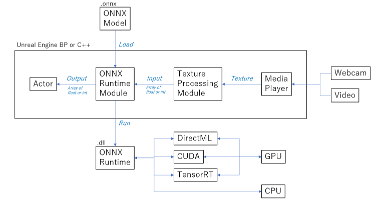

# Modules

NNEngine consists of the following four modules.

| Module | Description |
| ---- | ---- |
| OnnxRuntime | A module for executing AI using ONNX files. If you just want to use ONNX format AI, you only need this module. |
| TextureProcessing | A module for performing image processing on UTexture and creating input data to ONNX. It provides functions such as conversion from UTexture to byte array, scaling, cropping, and rotation. |
| DirectXUtility  (Windows only) | A module for getting a list of GPUs on a Windows PC. It is used to display a list of GPUs on the end user's PC to let the user to select one. |
| CustomizedOpenCV | A module that provides a set of useful functions for image processing. It is used by "2. TextureProcessing" module. |

Overview for the OnnxRuntime and TextureProcessing modules:  

{ loading=lazy }
