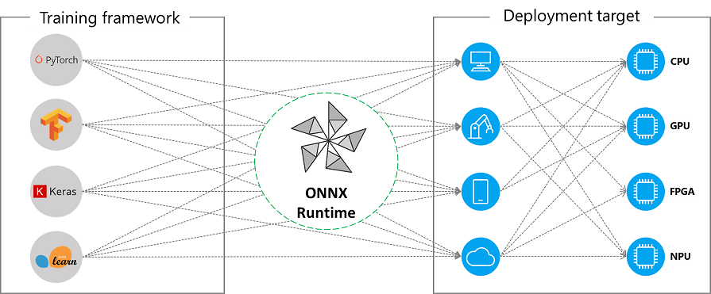

# Overview of ONNX

For those who have never used AI in ONNX format, here is a brief overview of ONNX.  
If you know the basics of ONNX, you don't need to read this.  

## What's ONNX?

ONNX  
= Open Neural Network eXchange  

- A format to use AI in various environment.
- [You can create files in this format from various machine learning frameworks](https://github.com/onnx/tutorials#converting-to-onnx-format), and  
  [you can run AI on various platforms with this format.](https://onnxruntime.ai/docs/execution-providers/#contents)

  
(https://onnxruntime.ai/docs/execution-providers/ より引用)

## How to get ONNX file

You can make it yourself from PyTorch, TensorFlow, etc. Also there are kind people who publish ONNX format AI for free.

- (Example 1) [ONNX Model Zoo](https://github.com/onnx/models): ONNX official  
- (Example 2) [PINTO model zoo](https://github.com/PINTO0309/PINTO_model_zoo): A repository where PINTO shares the results of optimization of various models. Various formats are provided, including ONNX.  

Check the license carefully before using them.🙏  

## How to use ONNX

Roughly there are 4 steps.  

1. Load the ONNX file.
2. Specify the input data source.
3. Specify the output data destination.
4. Run.

See [the Official Documentation](https://onnxruntime.ai/docs/get-started/) for the details.  
NNEngine provides convenient functions to execute 1 to 4 above.  