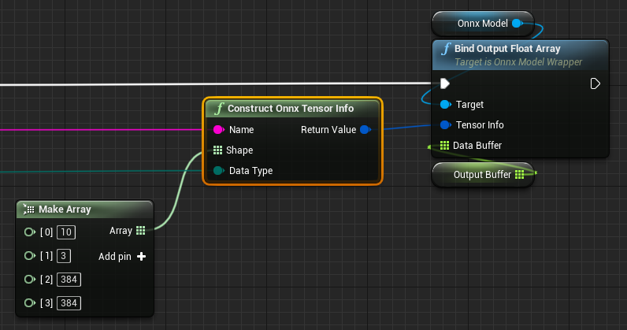
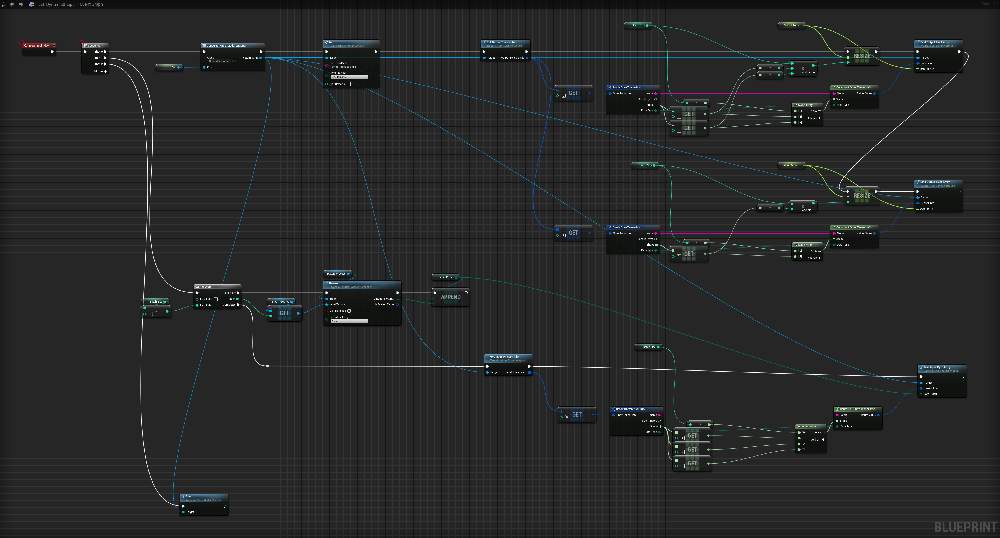

# Models with dynamic shape

Some ONNX models have negative values in its shape. For example, `-1 x 3 x 384 x 384`.  
`-1` means that the dimension is "dynamic" and you need to specify an integer value for the dimension at runtime.

## How to use models with dynamic shape

=== "BP"
	Specify the shape you want by calling `Construct Onnx Tensor Info` node.  
	Then specify the resultant `Onnx Tensor Info` to `Bind Input/Output xxx Array` for the ONNX model.  
	For example, here we specify 10 for the first dimension.

	{ loading=lazy }

=== "C++"
	Specify the shape you want by calling constructor for `FOnnxTensorInfo` with arguments.  
	Then specify the resultant `FOnnxTensorInfo` to the argument of `bindInput` or `bindOutput`.

    ```
	// For example, specify 10 for the first dimension
    TArray<int64> dynamicShape = { 10, 3, 384, 384 };

	// Construct Onnx Tensor Info
	// FOnnxTensorInfo(const FString& name, const TArray<int64>& shape, const EOnnxTensorDataType dataType)
    FOnnxTensorInfo dynamicShapeTensorInfo(name, dynamicShape, dataType);

	// Specify the resultant `FOnnxTensorInfo` to `bindOutput` for the ONNX model
    onnxModel->bindOutput(dynamicShapeTensorInfo, outputDataBuffer);
    ```

## Example

The example model used below has one input with `-1 x 384 x 384 x 3` shape and two outputs with `-1 x 17 x 2` and `-1 x 17` shapes.  
(The first dimension is `Batch size`.)

{ loading=lazy }