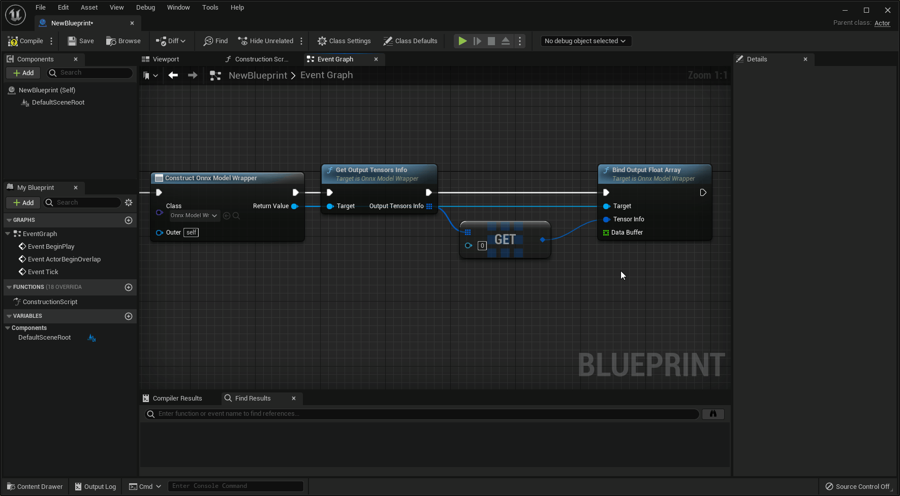
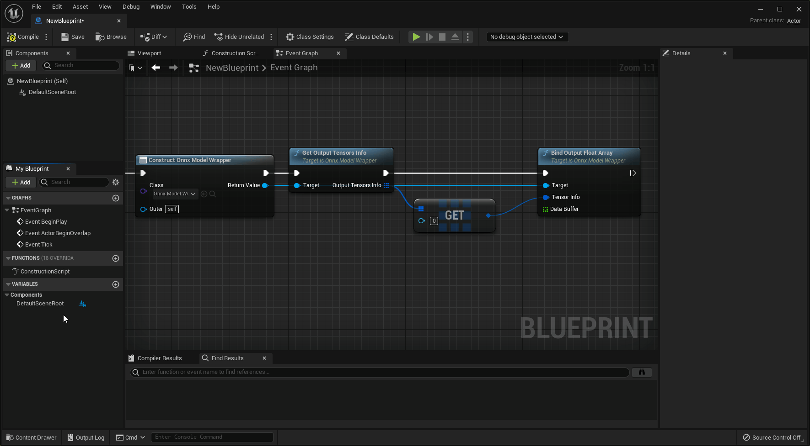

# Bind float array from Blueprint

Note that in Unreal Engine 5 blueprints, "Float" means double-precision (64-bit) floating-point variables by default.

<!-- ## モデルの入出力が*倍精度*の浮動小数点の場合

通常通りにFloat型の配列を作成し、ONNXモデルの`Bind Input Float 64 Array`と`Bind Output Float 64 Array`を使って入出力をバインドしてください。 -->

## For model with *single-precision* floating point inputs/outputs

Follow the steps below to create arrays of *single precision* Float type and bind them using `Bind Input Float Array` and `Bind Output Float Array`.

!!! Success "Proper steps to create a float array"

    Drag "Data Buffer" argument of `Bind Input Float Array` or `Bind Output Float Array`, and click "Promote to variable" to create a single precision float array.

    { loading=lazy }

??? Failure "Improper steps to create a float array"

    Clicking "+" button and specifying "Float" type result in double-precision float variable.  
    Implicit casting during data binding results in loss of reference information and incorrect operation.

    { loading=lazy }