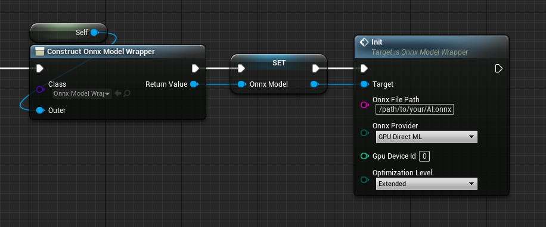
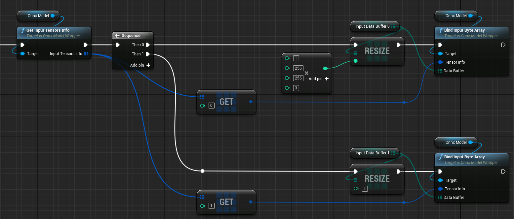
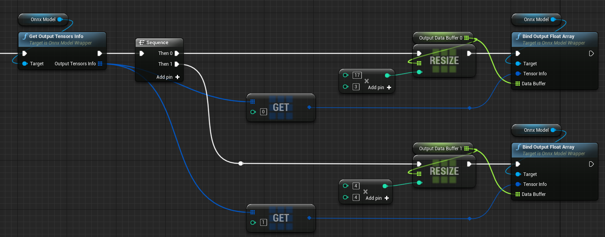
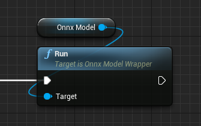

# OnnxRuntimeモジュールの使い方

このモジュールは、ONNX RuntimeのC++ APIをラップし、Unreal EngineのブループリントおよびC++から簡単に呼び出せるようにしたものです。  
BPからの使用例は、「Plugins\NNEngine\Content\MinimalExample\MinimalExampleOfOnnxModelWrapper.uasset」にあります。  

??? Question "ONNX?"
    ONNX自体の概要は、[ONNXの概要](../onnx-introduction)をご覧ください

??? Question "ONNX Runtime?"
    ONNX Runtime自体の使い方は、[公式ドキュメント](https://onnxruntime.ai/docs/)をご覧ください


## ONNXモデルのロード

ONNX形式で保存されたAIモデルを読み込みます。  
NNEngineでは、実行時に.onnxファイルのパスを指定して読み込みを行います。

=== "BP"
		
	1. ブループリントクラスを新規作成し、UOnnxModelWrapperの変数を追加します。
	2. UOnnxModelWrapperのコンストラクタを呼び出し、次に「Init」ノードを呼び出します。
	- このとき、ONNXモデルのパスを指定します。
	- また、CPUとGPUのどちらを使うか、GPUならどのGPUを使うかを指定します。
		- システムで利用可能なGPUの一覧を取得するには、[「Get Gpu Info」を呼び出します。](../how-to-use-directx-utility-module)

	{ loading=lazy }

=== "C++"
		
	1. C++クラスを作成し、OnnxModelの変数を追加します。
	2. OnnxModelのコンストラクタを呼び出します。
	- このとき、ONNXモデルのパスを指定します。
	- また、CPUとGPUのどちらを使うか、GPUならどのGPUを使うかを指定します。
		- システムで利用可能なGPUの一覧を取得するには、「UDirectXUtilityLibrary::GetGpuInfo()」を呼び出します。

	```
	#pragma once
	#include "OnnxModel.h"
	#include "OnnxModelMinimumExample.generated.h"

	UCLASS(Blueprintable, Category = "ONNX Runtime")
	class ONNXRUNTIME_API UOnnxModelMinimumExample : public UObject
	{
		GENERATED_BODY()

	protected:
		OnnxModel* onnxModel;

	public:
		UOnnxModelMinimumExample()
		{
			onnxModel = new OnnxModel("Full-path-to-your-AI.onnx", EOnnxProvider::GPU_DirectML, 0);
		}
	};
	```

## データ入力元の指定

=== "BP"

	1. 「Get Input Tensor Info」を呼び出して、入力テンソルの順番、型、サイズを確認します。
	2. 上記の型とサイズにあわせて、byte、integer、integer64、floatのいずれかの配列の変数を作成します。  
		UE5で、入力にfloat配列を使用する場合は、*単精度*のfloat配列を作成する必要があります。[このページ](../ue5-float-bp)を確認してください。
	3. 入力テンソルの数だけ「Bind Input xxx Array」を呼び出して、作成した配列をONNXモデルへのデータ入力元として指定します。

	{ loading=lazy }

=== "C++"

	1. 「OnnxModel::inputTensorsInfo」メンバを参照し、入力テンソルの順番、型、サイズを確認します。
	2. 上記の型とサイズにあわせて、byte、integer、integer64、floatのいずれかの配列の変数を作成します。
	3. 入力テンソルの数だけ「OnnxModel::bindInput」を呼び出して、作成した配列をONNXモデルへのデータ入力元として指定します。

	```
		TArray<uint8> inputDataBuffer0;
		TArray<uint8> inputDataBuffer1;
		void setupInputs()
		{
			inputDataBuffer0.Init(0, 1 * 256 * 256 * 3);
			inputDataBuffer1.Init(0, 1);
			onnxModel->bindInput(onnxModel->inputTensorsInfo[0], inputDataBuffer0.GetData());
			onnxModel->bindInput(onnxModel->inputTensorsInfo[1], inputDataBuffer1.GetData());
		}
	```

## データ出力先の指定

=== "BP"

	1. 「Get Output Tensor Info」を呼び出して、出力テンソルの順番、型、サイズを確認します。
	2. 上記の型とサイズにあわせて、byte、integer、integer64、floatのいずれかの配列の変数を作成します。
		UE5で、出力にfloat配列を使用する場合は、*単精度*のfloat配列を作成する必要があります。[このページ](../ue5-float-bp)を確認してください。
	3. 出力テンソルの数だけ「Bind Output xxx Array」を呼び出して、作成した配列をONNXモデルからのデータ出力先として指定します。

	{ loading=lazy }

=== "C++"

	1. 「OnnxModel::outputTensorsInfo」メンバを参照し、出力テンソルの順番、型、サイズを確認します。
	2. 上記の型とサイズにあわせて、byte、integer、integer64、floatのいずれかの配列の変数を作成します。
	3. 出力テンソルの数だけ「OnnxModel::bindOutput」を呼び出して、作成した配列をONNXモデルからのデータ出力先として指定します。

	```
		TArray<uint8> outputDataBuffer0;
		TArray<uint8> outputDataBuffer1;
		void setupOutputs()
		{
			outputDataBuffer0.Init(0, 17 * 3);
			outputDataBuffer1.Init(0, 4 * 4);
			onnxModel->bindOutput(onnxModel->outputTensorsInfo[0], outputDataBuffer0.GetData());
			onnxModel->bindOutput(onnxModel->outputTensorsInfo[1], outputDataBuffer1.GetData());
		}
	```

## 実行

1. ONNXモデルへのデータ入力元として指定した配列に、データをセットします。
2. 「Run」を実行します。
3. ONNXモデルからのデータ出力先として指定した配列から、結果を取得します。

=== "BP"

	{ loading=lazy }

=== "C++"
	`onnxModel->run();`