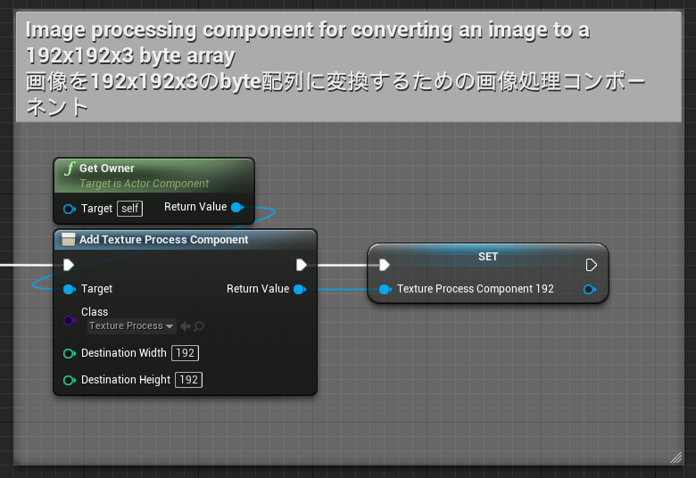

# TextureProcessingモジュールの使い方

BP_TextureProcessComponentを使って、画像処理を行います。  
BP_TextureProcessComponentは、UTextureの画像を指定したサイズのバイト配列に変換するためのコンポーネントです。また、その際、画像の拡縮・切り取り・回転を行うことができます。  
得られたバイト配列は、OnnxRuntimeモジュールでAIへの入力データとして利用できます。
デモプロジェクトの「Content\NNEngineDemo\MotionCapture_Bp\MotionCapture_BpImplementation.uasset」に使用例があります。

## Componentの作成

1. ブループリントクラスを新規作成し、BP_TextureProcessComponentを追加します。
2. Destination Width、Destination Heightの初期値に、画像処理後の画像サイズを指定します。  
   これにより、このBP_TextureProcessComponentでは、（Destination Height × Destination Width × 3）のサイズのバイト配列に結果が出力されるようになります。

{ loading=lazy }

## 単純な拡縮

BP_TextureProcessComponentの「Resize」ノードを呼び出すことで、初期化時に指定したサイズに画像を拡大または縮小することができます。

{ loading=lazy }

### 入力

- Input texture: 任意のUTextureを指定します
- Do Flip Image: 画像を左右反転するかどうかを指定します。
- Do Rotate Image: 画像を90度、180度、270度回転するかどうかを指定します。

### 出力

- outputHxWxBGR:  
  入力画像をアスペクト比を保ったまま（Destination Height × Destination Width）のサイズに拡大または縮小し、各ピクセルのBGR値を並べた（Destination Height × Destination Width × 3）のサイズのバイト配列です。入力と出力の画像のアスペクト比が異なる場合、出力の配列の一部は適当な値で埋められます。
- uvScalingFactor:  
  入力画像と出力画像のアスペクト比の比です。出力画像でのUV座標にこの値を掛けることで、入力画像でのUV座標を得ることができます。例えば、入力画像が16:9で出力画像が正方形だった場合、uvScalingFactorは (1, 1.777…) となります。

## アフィン変換

BP_TextureProcessComponentの「Affine Transform」ノードを呼び出すことで、入力画像をAffine変換した上で、初期化時に指定したサイズに画像を拡大または縮小することができます。  
Affine変換自体については、適当な線形代数の教科書を参照してください。

{ loading=lazy }

### 入力

- Input texture: 任意のUTextureを指定します
- Inverse Normalized Affine Mat:  
  入出力の画像サイズを(1, 1)としたときのAffine変換の逆行列を指定します。これはすなわち、UV座標でのAffine変換行列です。
- Do Flip Image: 画像を左右反転するかどうかを指定します。
- Do Rotate Image: 画像を90度、180度、270度回転するかどうかを指定します。

### 出力

- outputHxWxBGR:  
  Affine変換後の画像を（Destination Height × Destination Width）のサイズに拡大または縮小し、各ピクセルのBGR値を並べた（Destination Height × Destination Width × 3）のサイズのバイト配列です。

## Affine変換行列を求める関数1

「Get Inverse Affine Mat」ノードを呼び出すことで、画像を任意の正方形の領域にトリミングするアフィン変換を表す行列の逆行列を取得することができます。

{ loading=lazy }

### 入力

- Center: 切り出す正方形領域の中心を、入力画像の座標系で表した値
- Orientation: 
  切り出す正方形領域のY軸の向きを、入力画像の座標系で表した値。例えば、回転なしの場合は(0, 1)、時計回りに90度回転する場合は(-1, 0)とする。
- Size: 切り出す正方形領域の辺の長さを、入力画像の座標系で表した値

### 出力

- Out Inverse Affine Mat: 求めたAffine変換を表す行列の逆行列

## Affine変換行列を求める関数2

「Get Inverse Affine Mat」ノードを呼び出すことで、画像を任意の正方形の領域にトリミングするアフィン変換を表す行列の逆行列を取得することができます。

{ loading=lazy }

### 入力

- Center: 切り出す正方形領域の中心を、入力画像の座標系で表した値
- Top Center: 切り出す正方形領域の上端の中心を、入力画像の座標系で表した値
- Scaling Factor:  
  切り出す正方形領域の大きさ調整のパラメータ。(CenterとTop Centerの距離 × 2 × この値)が正方形領域の辺の長さとなる。

### 出力

- Out Inverse Affine Mat: 求めたAffine変換を表す行列の逆行列
