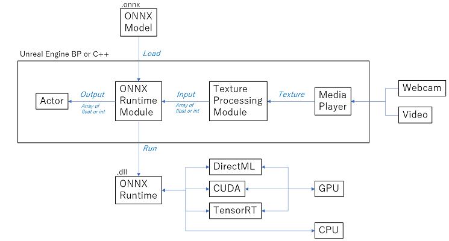

# モジュール構成

NNEngineは、下記の4つのモジュールで構成されています。

| モジュール | 詳細 |
| ---- | ---- |
| OnnxRuntime | ONNXファイルを使ってAIの実行を行うためのモジュール。単にONNX形式のAIを利用するだけなら、このモジュールだけ使えばOKです。 |
| TextureProcessing | UTextureに対して画像処理を行ってONNXへの入力データを作るためのモジュール。UTextureからバイト配列への変換や、拡縮・切り取り・回転などといった機能を提供します。 |
| DirectXUtility  (Windows only) | Windows PCのGPUの一覧を取得するためのモジュール。エンドユーザのPCのGPUの一覧を表示し選択させるといった用途に使います。 |
| CustomizedOpenCV | 画像処理のための便利な関数群を提供するモジュール。二つ目の「TextureProcessing」モジュール内部で利用しています。 |

OnnxRuntime と TextureProcessing モジュールの全体構成

{ loading=lazy }