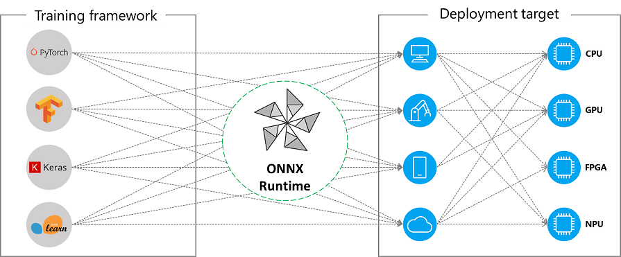

# ONNXの概要

ONNX形式でAIを扱ったことがない人向けに、ONNXについて簡単に概要を説明します。  
ONNXについて基本的なことをご存じの方は、読む必要はありません。

## ONNXとは?

ONNX  
= Open Neural Network eXchange  
= オープンなニューラルネットの相互変換フォーマット、というような意味

- AIを様々な環境で使うためのファイル形式。
- [様々な機械学習フレームワークからこの形式のファイルを作成でき](https://github.com/onnx/tutorials#converting-to-onnx-format)、この形式にしておけば[様々なプラットフォームでAIを実行できる](https://onnxruntime.ai/docs/execution-providers/#contents)

  
(https://onnxruntime.ai/docs/execution-providers/ より引用)

## ONNXファイルの入手方法

PyTorchやTensorFlowなどから自分で作ってもいいですが、ONNX形式のAIを無料で公開してくれている親切な人が世の中にはいます。

- (例1) [ONNX Model Zoo](https://github.com/onnx/models) : ONNX公式
- (例2) [PINTO model zoo](https://github.com/PINTO0309/PINTO_model_zoo) : PINTO氏が様々なモデルを最適化した結果を共有しているリポジトリ。ONNXを含む様々な形式が提供されている。  

ライセンスをよく確認した上で、ありがたく使わせていただきましょう。🙏

## ONNXの使用方法

大まかには、下記の4ステップです。

1. ONNXファイルをロードする
2. データ入力元を指定する
3. データ出力先を指定する
4. 処理を実行する

より詳細は、[公式ドキュメント](https://onnxruntime.ai/docs/get-started/)を参照してください。  
NNEngineは、上記1～4を実行するための便利な関数を提供します。  