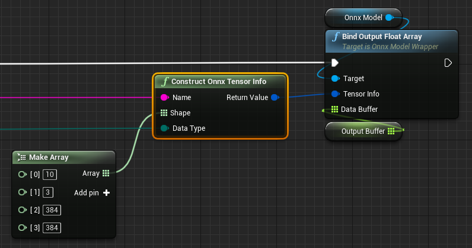

# 動的な入出力形状を持つモデル

ONNXモデルには、例えば、`-1 x 3 x 384 x 384`のように、その入出力形状に負の値を持つものがあります。  
`-1`は、その軸が「動的」であることを意味し、実行時にその軸に適切な整数値を指定する必要があります。

## 動的な入出力形状を持つモデルの使い方

=== "BP"
	`Onnx Tensor Info`ノードを呼び出し、適当な値をShapeに指定します。  
	得られた`Onnx Tensor Info`を、ONNXモデルの`Bind Input/Output xxx Array`に指定します。  
	例えば、ここでは1次元目に10を指定します。  

	{ loading=lazy }

=== "C++"
	引数ありの`FOnnxTensorInfo`のコンストラクタを呼び出し、適当なshapeを指定します。  
	そして、`bindInput`または`bindOutput`の引数に、生成された`FOnnxTensorInfo`を指定します。

    ```
	// For example, specify 10 for the first dimension
    TArray<int64> dynamicShape = { 10, 3, 384, 384 };

	// Construct Onnx Tensor Info
	// FOnnxTensorInfo(const FString& name, const TArray<int64>& shape, const EOnnxTensorDataType dataType)
    FOnnxTensorInfo dynamicShapeTensorInfo(name, dynamicShape, dataType);

	// Specify the resultant `FOnnxTensorInfo` to `bindOutput` for the ONNX model
    onnxModel->bindOutput(dynamicShapeTensorInfo, outputDataBuffer);
    ```

## 実装例

下記は、`-1 x 384 x 384 x 3`の形状を持つ入力1つと、`-1 x 17 x 2`と`-1 x 17`の形状の出力2つを持つモデルの実装例です。 
(入出力の最初の次元は、いわゆる`Batch size`です)  

{ loading=lazy }