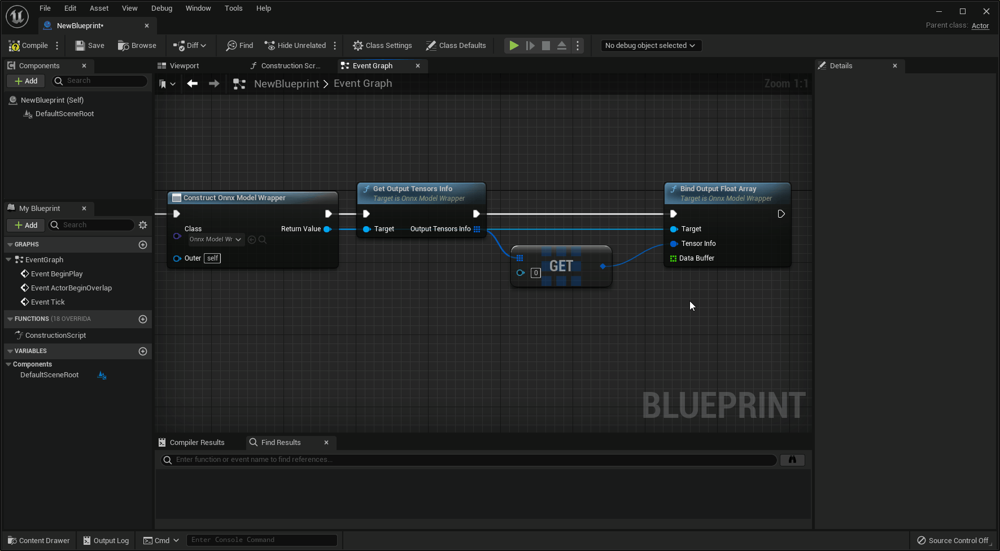
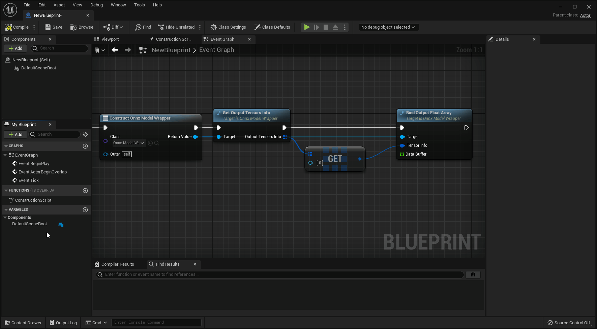

# Unreal Engine 5 で BP から Float 型の入出力をバインドする

Unreal Engine 5のブループリントでは、通常の手順でFloat型の配列を作成すると、倍精度(64bit)の浮動小数点の変数が作成されることに注意してください。

<!-- ## モデルの入出力が*倍精度*の浮動小数点の場合

通常通りにFloat型の配列を作成し、ONNXモデルの`Bind Input Float 64 Array`と`Bind Output Float 64 Array`を使って入出力をバインドしてください。 -->

## モデルの入出力が*単精度*の浮動小数点の場合

下記の手順で*単精度*のFloat型の配列を作成し、ONNXモデルの`Bind Input Float Array`と`Bind Output Float Array`を使って入出力をバインドしてください。

!!! Success "適切なFloat型の配列の作成手順"

    `Bind Input Float Array`や`Bind Output Float Array`の引数をドラッグして、「変数へ昇格」をクリックすることで、単精度のFloat型が作成されます。

    { loading=lazy }

??? Failure "適切でないFloat型の配列の作成手順"

    通常の手順でFloat型の配列を作成すると、倍精度(64bit)の浮動小数点の変数が作成されてしまいます。  
    データバインド時に暗黙のキャストが行われることにより、参照情報が失われ、正しく動作しません。

    { loading=lazy }