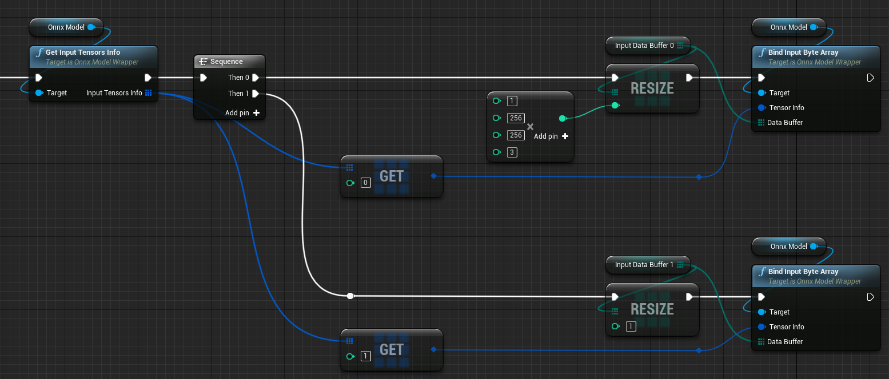

# Manual / マニュアル {#mainpage}

## Overview / 概要

- A code plugin for [Unreal Engine 4](https://www.unrealengine.com/) to use [ONNX](https://onnx.ai/) model.
- Provides easy-to-use functions for accelerated machine learning inference callable from BP and C++ using [ONNX Runtime](https://onnxruntime.ai/) native library.
- Also, provides utility functions such as resizing, cropping, rotating UTexture and converting it to int8 array.
- [Demo project](./md_html__demo_project_overview.html) of human pose estimation and facial capture using a single RGB camera is available on GitHub.
- 
- [Unreal Engine 4](https://www.unrealengine.com/) で [ONNX](https://onnx.ai/) モデルを動かすためのプラグインです。
- ブループリントとC++から機械学習推論を簡単・高速実行できる機能を提供します。内部では[ONNX Runtime](https://onnxruntime.ai/)ネイティブライブラリを使用しています。
- また、UTextureをリサイズ、トリミング、回転したうえでint8配列へ変換する機能等を提供します。
- 人物姿勢推定と表情のキャプチャを行う[デモプロジェクト](./md_html__demo_project_overview.html)も公開しています。

--

## System Requirements / 動作環境

- Supported Platform: Windows 10 64bit
- Supported UE4 version: 4.26, 4.27
- To use GPU acceleration with DirectML, a DirectX 12 capable GPU is required.
- To use GPU acceleration with CUDA and TensorRT, a supported NVIDIA GPU is required and the following versions of CUDA, cuDNN, and TensorRT are required to be installed. 
- 
- 対応プラットフォーム：Windows 10 64bit
- 対応UE4バージョン：4.26, 4.27
- DirectMLによるGPUアクセラレーションには、DirectX 12対応GPUが必要です。
- TensorRTによるGPUアクセラレーションには、対応するNVIDIA GPUが必要です。また、下記に記載の特定バージョンのCUDA、cuDNN、TensorRTのインストールが必要です。

#### CUDA, cuDNN, TensorRT versions

|          | Other than RTX30** series               | RTX30** series                             |
| -------- | --------------------------------------- | ------------------------------------------ |
| CUDA     | 11.0.3                                  | 11.0.3                                     |
| cuDNN    | v8.0.2 (July 24th, 2020), for CUDA 11.0 | v8.0.5 (November 9th, 2020), for CUDA 11.0 |
| TensorRT | 7.1.3.4 for CUDA 11.0                   | 7.2.2.3 for CUDA 11.0                      |

If you are using RTX2080Ti, you might need to use cuDNN v8.0.5. Please try various combinations.  

--

## Installation / インストール

<!-- ### From BOOTH

1. Purchase at https://akiya-souken.booth.pm/items/3494484 and download "NNEngine_vX.Y.Z.zip" (X.Y.Z is the version number).
2. Extract the downloaded zip file.
3. Create an Unreal Engine project.
4. Copy the "NNEngine_vX.Y.Z\Plugins" created by extracting the zip file to the folder containing the .uproject file of the created project.

1. https://akiya-souken.booth.pm/items/3494484 で購入し、「NNEngine_vX.Y.Z.zip」(X.Y.Zはバージョン番号)をダウンロードします。
2. ダウンロードしたZipファイルを展開します。
3. Unreal Engineのプロジェクトを作成します。
4. 作成したプロジェクトの.uprojectファイルのあるフォルダに、Zipファイルを展開してできた「NNEngine_vX.Y.Z\Plugins」をコピーします。 -->

### From UE Marketplace

1. Purchase at https://www.unrealengine.com/marketplace/product/74892c770dc149b1b5c4e872804e6ade and install it.
2. Create an Unreal Engine project.
3. Open the project, open "Edit > Plugins" on the editor menu, enable "NNEngine", and restart the project.

1. https://www.unrealengine.com/marketplace/product/74892c770dc149b1b5c4e872804e6ade で購入し、インストールします。
2. Unreal Engineのプロジェクトを作成します。
3. プロジェクトを開き、エディタのメニュー上で「編集 > プラグイン」を開き、「NNEngine」を有効にし、プロジェクトを再起動します。

--

## Modules / モジュール構成

NNEngine consists of the following four modules.

1. OnnxRuntime  
   A module for executing AI using ONNX files.  
   If you just want to use ONNX format AI, you only need this module.  

2. TextureProcessing  
   A module for performing image processing on UTexture and creating input data to ONNX.  
   It provides functions such as conversion from UTexture to byte array, scaling, cropping, and rotation.  

3. DirectXUtility  
   A module for getting a list of GPUs on a Windows PC.  
   It is used to display a list of GPUs on the end user's PC to let the user to select one.  
   
4. CustomizedOpenCV  
   A module that provides a set of useful functions for image processing.  
   It is used by "2. TextureProcessing" module.  

NNEngineは、下記の4つのモジュールで構成されています。

1. OnnxRuntime  
   ONNXファイルを使ってAIの実行を行うためのモジュール。  
   単にONNX形式のAIを利用するだけなら、このモジュールだけ使えばOKです。  

2. TextureProcessing  
   UTextureに対して画像処理を行ってONNXへの入力データを作るためのモジュール。  
   UTextureからバイト配列への変換や、拡縮・切り取り・回転などといった機能を提供します。  

3. DirectXUtility  
   Windows PCのGPUの一覧を取得するためのモジュール。  
   エンドユーザのPCのGPUの一覧を表示し選択させるといった用途に使います。  
   
4. CustomizedOpenCV  
   画像処理のための便利な関数群を提供するモジュール。  
   2のTextureProcessingモジュール内部で利用しています。  

Overview for the OnnxRuntime and TextureProcessing modules:  
  

--

## How to use OnnxRuntime module / OnnxRuntimeモジュールの使い方

This module wraps the ONNX Runtime's C++ API and makes it easy to call from Unreal Engine's Blueprints and C++.  
An example of use from BP can be found in "Plugins\NNEngine\Content\MinimalExample\MinimalExampleOfOnnxModelWrapper.uasset".  
(See [Overview of ONNX](./md_html__onnx_introduction.html) for the overview of ONNX itself)  
(See [the official documentation](https://onnxruntime.ai/docs/) for how to use ONNX Runtime itself)  

このモジュールは、ONNX RuntimeのC++ APIをラップし、Unreal EngineのブループリントおよびC++から簡単に呼び出せるようにしたものです。  
BPからの使用例は、「Plugins\NNEngine\Content\MinimalExample\MinimalExampleOfOnnxModelWrapper.uasset」にあります。  
（ONNX自体の概要は、[ONNXの概要](./md_html__onnx_introduction.html)をご覧ください）  
（ONNX Runtime自体の使い方は、[公式ドキュメント](https://onnxruntime.ai/docs/)をご覧ください）  

### Load ONNX model / ONNXモデルのロード

Load the AI ​​model saved in ONNX format.  
NNEngine reads the .onnx file by specifying the path at runtime.  


ONNX形式で保存されたAIモデルを読み込みます。  
NNEngineでは、実行時に.onnxファイルのパスを指定して読み込みを行います。

#### BP

1. Create a Blueprint class and add a variable of UOnnxModelWrapper.
2. Construct UOnnxModelWrapper and call "Init".
   - Specify the path to the ONNX model
   - Specify whether to use CPU or GPU, and which GPU to use.
     - To get available GPUs on the system, [call "Get Gpu Info".](#autotoc_md47)
     
1. ブループリントクラスを新規作成し、UOnnxModelWrapperの変数を追加します。
2. UOnnxModelWrapperのコンストラクタを呼び出し、次に「Init」ノードを呼び出します。
   - このとき、ONNXモデルのパスを指定します。
   - また、CPUとGPUのどちらを使うか、GPUならどのGPUを使うかを指定します。
     - システムで利用可能なGPUの一覧を取得するには、[「Get Gpu Info」を呼び出します。](#autotoc_md47)


#### C++

1. Create a C++ class and add a variable of OnnxModel.
2. Call the constructor of OnnxModel.
   - Specify the path to the ONNX model
   - Specify whether to use CPU or GPU, and which GPU to use.
     - To get available GPUs on the system, call "UDirectXUtilityLibrary::GetGpuInfo()"
     
1. C++クラスを作成し、OnnxModelの変数を追加します。
2. OnnxModelのコンストラクタを呼び出します。
   - このとき、ONNXモデルのパスを指定します。
   - また、CPUとGPUのどちらを使うか、GPUならどのGPUを使うかを指定します。
     - システムで利用可能なGPUの一覧を取得するには、「UDirectXUtilityLibrary::GetGpuInfo()」を呼び出します。

```
#pragma once
#include "OnnxModel.h"
#include "OnnxModelMinimumExample.generated.h"

UCLASS(Blueprintable, Category = "ONNX Runtime")
class ONNXRUNTIME_API UOnnxModelMinimumExample : public UObject
{
	GENERATED_BODY()

protected:
	OnnxModel* onnxModel;

public:
	UOnnxModelMinimumExample()
	{
		onnxModel = new OnnxModel("Full-path-to-your-AI.onnx", EOnnxProvider::GPU_DirectML, 0);
	}
};
```

### Specify input source / データ入力元の指定

#### BP

1. Call "Get Input Tensor Info" to confirm the order of the input tensors as well as their types and sizes.
2. Add variables of byte, integer, integer64, or float arrays whose types and sizes match the previous results.
3. Call "Bind Input xxx Array" for each input tensor and specify the created array as the data input sources to the ONNX model.

1. 「Get Input Tensor Info」を呼び出して、入力テンソルの順番、型、サイズを確認します。
2. 上記の型とサイズにあわせて、byte、integer、integer64、floatのいずれかの配列の変数を作成します。
3. 入力テンソルの数だけ「Bind Input xxx Array」を呼び出して、作成した配列をONNXモデルへのデータ入力元として指定します。



#### C++

1. Get "inputTensorsInfo" member to confirm the order of the input tensors as well as their types and sizes.
2. Add variables of arrays whose size in bytes match the previous results.
3. Call "bindInput" as many as the number of input tensors and specify the created arrays as the data input sources to the ONNX model.

1. 「OnnxModel::inputTensorsInfo」メンバを参照し、入力テンソルの順番、型、サイズを確認します。
2. 上記の型とサイズにあわせて、byte、integer、integer64、floatのいずれかの配列の変数を作成します。
3. 入力テンソルの数だけ「OnnxModel::bindInput」を呼び出して、作成した配列をONNXモデルへのデータ入力元として指定します。

```
	TArray<uint8> inputDataBuffer0;
	TArray<uint8> inputDataBuffer1;
	void setupInputs()
	{
		inputDataBuffer0.Init(0, 1 * 256 * 256 * 3);
		inputDataBuffer1.Init(0, 1);
		onnxModel->bindInput(onnxModel->inputTensorsInfo[0], inputDataBuffer0.GetData());
		onnxModel->bindInput(onnxModel->inputTensorsInfo[1], inputDataBuffer1.GetData());
	}
```

### Specify output destination / データ出力先の指定

#### BP

1. Call "Get Output Tensor Info" to confirm the order of the output tensors as well as their types and sizes.
2. Add variables of byte, integer, integer64, or float arrays whose types and sizes match the previous results.
3. Call "Bind Output xxx Array" for each output tensor and specify the created array as the data output destination from the ONNX model.

1. 「Get Output Tensor Info」を呼び出して、出力テンソルの順番、型、サイズを確認します。
2. 上記の型とサイズにあわせて、byte、integer、integer64、floatのいずれかの配列の変数を作成します。
3. 出力テンソルの数だけ「Bind Output xxx Array」を呼び出して、作成した配列をONNXモデルからのデータ出力先として指定します。


#### C++

1. Get "outputTensorsInfo" member to confirm the order of the output tensors as well as their types and sizes.
2. Add variables of array whose size in bytes match the previous result.
3. Call "bindOutput" for each output tensor and specify the created array as the data output destination from the ONNX model.

1. 「OnnxModel::outputTensorsInfo」メンバを参照し、出力テンソルの順番、型、サイズを確認します。
2. 上記の型とサイズにあわせて、byte、integer、integer64、floatのいずれかの配列の変数を作成します。
3. 出力テンソルの数だけ「OnnxModel::bindOutput」を呼び出して、作成した配列をONNXモデルからのデータ出力先として指定します。

```
	TArray<uint8> outputDataBuffer0;
	TArray<uint8> outputDataBuffer1;
	void setupOutputs()
	{
		outputDataBuffer0.Init(0, 17 * 3);
		outputDataBuffer1.Init(0, 4 * 4);
		onnxModel->bindOutput(onnxModel->outputTensorsInfo[0], outputDataBuffer0.GetData());
		onnxModel->bindOutput(onnxModel->outputTensorsInfo[1], outputDataBuffer1.GetData());
	}
```

### Run / 実行

1. Set data to the array specified as the data input source for the ONNX model.
2. Call "Run".
3. Get data from the array specified as the data output destination for the ONNX model.

1. ONNXモデルへのデータ入力元として指定した配列に、データをセットします。
2. 「Run」を実行します。
3. ONNXモデルからのデータ出力先として指定した配列から、結果を取得します。

#### BP


#### C++
```
		onnxModel->run();
```
--

## How to use TextureProcessing / TextureProcessingモジュールの使い方

Use BP_TextureProcessComponent to precess images.  
BP_TextureProcessComponent is a component for converting a UTexture image into a byte array of a specified size, as well as  scaling, cropping, and rotating the image.  
The resulting byte array can be used as input data to AI.
An example can be found in "Content\NNEngineDemo\MotionCapture_Bp\MotionCapture_BpImplementation.uasset" of the demo project.

BP_TextureProcessComponentを使って、画像処理を行います。  
BP_TextureProcessComponentは、UTextureの画像を指定したサイズのバイト配列に変換するためのコンポーネントです。また、その際、画像の拡縮・切り取り・回転を行うことができます。  
得られたバイト配列は、OnnxRuntimeモジュールでAIへの入力データとして利用できます。
デモプロジェクトの「Content\NNEngineDemo\MotionCapture_Bp\MotionCapture_BpImplementation.uasset」に使用例があります。

### Create component / Componentの作成

1. Create a Blueprint class and add BP_TextureProcessComponent.
2. Specify the image size after image processing as the initial values ​​of Destination Width and Destination Height.  
   This BP_TextureProcessComponent will output the result to a byte array with a size of (Destination Height x Destination Width x 3).

1. ブループリントクラスを新規作成し、BP_TextureProcessComponentを追加します。
2. Destination Width、Destination Heightの初期値に、画像処理後の画像サイズを指定します。  
   これにより、このBP_TextureProcessComponentでは、（Destination Height × Destination Width × 3）のサイズのバイト配列に結果が出力されるようになります。


### Simple Scaling / 単純な拡縮

You can scale an image to the size specified at initialization by calling the "Resize" node of BP_TextureProcessComponent.  
BP_TextureProcessComponentの「Resize」ノードを呼び出すことで、初期化時に指定したサイズに画像を拡大または縮小することができます。


#### Input / 入力
- Input texture: Original image. 任意のUTextureを指定します
- Do Flip Image: Whether to flip the image during resizing. 画像を左右反転するかどうかを指定します。
- Do Rotate Image: Whether to rotate the image during resizing. 画像を90度、180度、270度回転するかどうかを指定します。

#### Output / 出力
- outputHxWxBGR:  
  An array of BGR values of each pixel of the image resized to (Destination Height x Destination Width), while keeping the aspect ratio. If the input and output images have different aspect ratios, part of the output array will be filled with some values.  
  入力画像をアスペクト比を保ったまま（Destination Height × Destination Width）のサイズに拡大または縮小し、各ピクセルのBGR値を並べた（Destination Height × Destination Width × 3）のサイズのバイト配列です。入力と出力の画像のアスペクト比が異なる場合、出力の配列の一部は適当な値で埋められます。
- uvScalingFactor:  
  The ratio of the aspect ratios of input and output images. By multiplying the UV coordinates in the output image by this value, you can get the UV coordinates in the input image. For example, if the input image is 16:9 and the output image is square, the uvScalingFactor will be (1, 1.777…).  
  入力画像と出力画像のアスペクト比の比です。出力画像でのUV座標にこの値を掛けることで、入力画像でのUV座標を得ることができます。例えば、入力画像が16:9で出力画像が正方形だった場合、uvScalingFactorは (1, 1.777…) となります。

### Affine transform / アフィン変換

By calling the "Affine Transform" node of BP_TextureProcessComponent, you can transform the input image and then scale it to the size specified at initialization.  
See a linear algebra textbook for affine transformation itself.

BP_TextureProcessComponentの「Affine Transform」ノードを呼び出すことで、入力画像をAffine変換した上で、初期化時に指定したサイズに画像を拡大または縮小することができます。  
Affine変換自体については、適当な線形代数の教科書を参照してください。


#### Input / 入力
- Input texture: Original image. 任意のUTextureを指定します
- Inverse Normalized Affine Mat:  
  Specifies the inverse of the matrix which represents the affine transformation when the input / output image size is (1, 1). This is equal to the matrix which represents the affine transformation in UV coordinates.  
  入出力の画像サイズを(1, 1)としたときのAffine変換の逆行列を指定します。これはすなわち、UV座標でのAffine変換行列です。
- Do Flip Image: Whether to flip the image during resizing. 画像を左右反転するかどうかを指定します。
- Do Rotate Image: Whether to rotate the image during resizing. 画像を90度、180度、270度回転するかどうかを指定します。

#### Output / 出力
- outputHxWxBGR:  
  An array of BGR values of each pixel of the image after transformation and resizing to (Destination Height x Destination Width).  
  Affine変換後の画像を（Destination Height × Destination Width）のサイズに拡大または縮小し、各ピクセルのBGR値を並べた（Destination Height × Destination Width × 3）のサイズのバイト配列です。

### Function to find the Affine transformation matrix 1 / Affine変換行列を求める関数1

By calling the "Get Inverse Affine Mat" node, you can find the inverse matrix of the matrix that represents the affine transformation that crops an image to an arbitrary square area.  
「Get Inverse Affine Mat」ノードを呼び出すことで、画像を任意の正方形の領域にトリミングするアフィン変換を表す行列の逆行列を取得することができます。


#### Input / 入力
- Center: The center of the square area in the coordinate of the input image. 切り出す正方形領域の中心を、入力画像の座標系で表した値
- Orientation: 
  The orientation of the Y-axis of the square area in the coordinate of the input image. For example, (0, 1) when there is no rotation, and (-1, 0) when rotating 90 degrees clockwise.  
  切り出す正方形領域のY軸の向きを、入力画像の座標系で表した値。例えば、回転なしの場合は(0, 1)、時計回りに90度回転する場合は(-1, 0)とする。
- Size: The length of the side of the square area in the coordinate of the input image. 切り出す正方形領域の辺の長さを、入力画像の座標系で表した値

#### Output / 出力
- Out Inverse Affine Mat: Inverse matrix of the matrix representing the obtained affine transformation 求めたAffine変換を表す行列の逆行列

### Function to find the Affine transformation matrix 2 / Affine変換行列を求める関数2

By calling the "Get Inverse Affine Mat From 2 Points" node, you can find the inverse matrix of the matrix that represents the affine transformation that crops an image to an arbitrary square area.  
「Get Inverse Affine Mat」ノードを呼び出すことで、画像を任意の正方形の領域にトリミングするアフィン変換を表す行列の逆行列を取得することができます。


#### Input / 入力
- Center: The center of the square area in the coordinate of the input image. 切り出す正方形領域の中心を、入力画像の座標系で表した値
- Top Center: The center of the top edge of the square area in the coordinate of the input image. 切り出す正方形領域の上端の中心を、入力画像の座標系で表した値
- Scaling Factor:  
  Parameter for adjusting the size of the square area. The side of the square area will be (The distance between Center and Top Center * 2 * this value).  
  切り出す正方形領域の大きさ調整のパラメータ。(CenterとTop Centerの距離 × 2 × この値)が正方形領域の辺の長さとなる。

#### Output / 出力
- Out Inverse Affine Mat: Inverse matrix of the matrix representing the obtained affine transformation 求めたAffine変換を表す行列の逆行列

--

## How to use DirectXUtility module / DirectXUtilityモジュールの使い方

An example can be found in "Content\NNEngineDemo\Common\WidgetToChangeCpuGpu.uasset" of the demo project.  
デモプロジェクトの「Content\NNEngineDemo\Common\WidgetToChangeCpuGpu.uasset」に例があります。

1. Call the "Get Gpu Info" node to get an array of Gpu Info structures, which is a list of GPUs available on your PC.
2. You can get the device ID and name from the Gpu Info structure.
3. You can specify which GPU to use by specifying this device ID when initializing the UOnnxModelWrapper or OnnxModel.

1. 「Get Gpu Info」ノードを呼び出すと、PCで利用可能なGPUのリストであるGpu Info構造体の配列が取得できます。
2. Gpu Info構造体から、デバイスIDと名前が取得できます。
3. このデバイスIDをUOnnxModelWrapperまたはOnnxModelの初期化時に指定することで、使用するGPUを指定できます。


--


## How to use CustomizedOpenCV module / CustomizedOpenCVモジュールの使い方

Based on OpenCV 4.4.0, some functions are disabled so that it can be built with Unreal Engine.  
It can be used in C++ by including the OpenCV header as shown below.  

OpenCV 4.4.0をベースに、Unreal Engineでビルドできるよう一部の関数を無効にしたものです。  
C++で、下記のようにOpenCVのヘッダをインクルードすることで利用できます。

```
##undef check // the check macro causes problems with opencv headers
##include "opencv2/core/core.hpp"
```

Note that this module is created only for use from the TextureProcessing module, and not all OpenCV functions can be used.  
See [the official documentation](https://opencv.org/) for how to use OpenCV itself.  

なお、あくまでTextureProcessingモジュールからの利用のために作成されたモジュールであり、OpenCVの全ての機能が利用可能なわけではありません。  
OpenCV自体の使い方は、[公式ドキュメント](https://opencv.org/)をご覧ください。

--

## Build / ビルド

### Build without CUDA and TensorRT / CUDAとTensorRTを除外してビルドする

This plugin contains a large (162MB) DLL, "onnxruntime_providers_cuda.dll". You may want to exclude it to reduce packaged game size.  
To do that, you need to disable CUDA and TensorRT [execution providers](https://onnxruntime.ai/docs/execution-providers/) by following the steps below:

- Open "(Your installation path of UE4)/Engine/Plugins/Marketplace/NNEngine/Source/OnnxRuntime/OnnxRuntime.Build.cs"
- Change line 20 and 21 as follows:

  Before

  		bool doUseCuda = true;
  		bool doUseTensorRT = true;

  After

  		bool doUseCuda = false;
  		bool doUseTensorRT = false;

- Build the project.

このプラグインには、大きなサイズ（162MB）のDLL「onnxruntime_providers_cuda.dll」が含まれています。パッケージ化したゲームのサイズを小さくするために、これを除外したくなるかもしれません。
その場合、下記手順にしたがって、CUDA および TensorRT の [execution provider](https://onnxruntime.ai/docs/execution-providers/) を無効にする必要があります。

- "(UE4インストールパス)/Engine/Plugins/Marketplace/NNEngine/Source/OnnxRuntime/OnnxRuntime.Build.cs"を開きます。
- 20行目と21行目を下記の通り変更します。

  変更前

  		bool doUseCuda = true;
  		bool doUseTensorRT = true;

  変更後

  		bool doUseCuda = false;
  		bool doUseTensorRT = false;

- プロジェクトをビルドします。

--

## Changelog / 更新履歴

- v1.0 (2021-12-21)
  - First release.